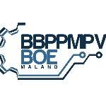
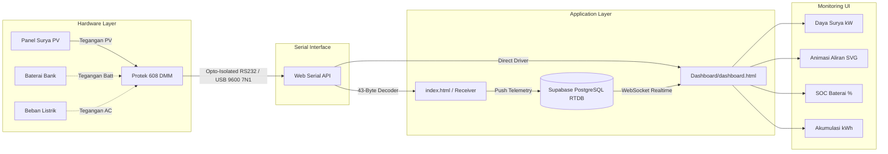

<div align="center">

  

  # Monitoring Energi Surya VEDC Malang
  ### *Real-Time Solar Photovoltaic & Energy Storage Telemetry System*
  #### **BBPPMPV BOE (VEDC) Malang &bull; Protek 608 Digital Multimeter Integration**

  <p align="center">
    <a href="#fitur-utama"></a>
    <a href="#protokol-komunikasi-protek-608"></a>
    <a href="#persyaratan-hardware--software"></a>
    <a href="#konfigurasi-cloud-database-supabase"></a>
    <a href="LICENSE"></a>
  </p>

  <p align="center">
    Aplikasi pemantauan realtime untuk pembangkit listrik tenaga surya (PLTS) dan baterai bank laboratorium berbasis komunikasi optik/serial <b>Protek 608</b> dan <b>Supabase Realtime Cloud Database</b>.
  </p>

</div>

---

## Daftar Isi
1. [Tentang Proyek](#tentang-proyek)
2. [Fitur Utama](#fitur-utama)
3. [Arsitektur Sistem](#arsitektur-sistem)
4. [Struktur Folder](#struktur-folder)
5. [Protokol Komunikasi Protek 608](#protokol-komunikasi-protek-608)
6. [Persyaratan Hardware & Software](#persyaratan-hardware--software)
7. [Panduan Menjalankan Aplikasi](#panduan-menjalankan-aplikasi)
8. [Konfigurasi Cloud Database (Supabase)](#konfigurasi-cloud-database-supabase)
9. [Lisensi & Pengembang](#lisensi--pengembang)

---

## Tentang Proyek

Proyek ini dikembangkan untuk sistem pemantauan telemetri energi surya mandiri pada instalasi laboratorium **BBPPMPV BOE (VEDC) Malang**. Sistem menghubungkan instrumen presisi digital multimeter **Protek 608** secara langsung ke browser melalui **Web Serial API** (tanpa perlu instalasi server lokal/driver tambahan), kemudian mendekode paket data 43-byte secara realtime dan menyinkronkannya ke cloud menggunakan **Supabase PostgreSQL Realtime Database**.

Data telemetri disajikan dalam bentuk dashboard visual modern dengan visualisasi aliran daya SVG dinamis, estimasi kapasitas baterai (SOC) kurva OCV nyata, serta kalkulasi kWh energi bersih.

---

## Fitur Utama

- **Direct Web Serial Communication**: Terhubung langsung ke kabel optik/RS232-USB multimeter Protek 608 langsung dari browser (Chrome / Edge) tanpa backend runtime.
- **Decoder Protokol Protek 608 Asli**: Mendekode framing paket 43-byte (`0x5B` s.d. `0x5D`), *bit-reversal*, dan decoding 7-segment display digit secara realtime.
- **Supabase Realtime Cloud Sync**: Menyiarkan data voltase, satuan, mode, dan target channel secara instan ke cloud database PostgreSQL dengan koneksi WebSocket Realtime.
- **Aliran Energi Dinamis (Interactive SVG Flow)**: Menampilkan visualisasi animasi aliran daya antara **Panel Surya (PV)**, **Inverter/MPPT**, **Baterai Bank**, dan **Beban Listrik** secara otomatis.
- **Estimasi Baterai OCV-SOC Riil**: Dilengkapi algoritma pemetaan tegangan baterai ke State of Charge (SOC 0% - 100%) serta status pengisian (*Bulk / Absorption / Float / Discharging*).
- **Probe Channel Selector**: Memungkinkan pemilihan titik ukur multimeter (*Panel Surya*, *Baterai Bank*, atau *Beban Listrik*) langsung dari antarmuka dashboard.
- **Akumulasi Energi Nyata (kWh Integrator)**: Menghitung total produksi kWh harian berbasis integrasi waktu nyata ($\int P \, dt$).
- **Modern Dark UI Theme**: Desain profesional dengan TailwindCSS, tipografi Chakra Petch / Inter, dan logo resmi BBPPMPV BOE Malang.

---

## Arsitektur Sistem



---

## Struktur Folder

```text
Protek608/
├── assets/
│   └── logo-boe.png          # Logo resmi BBPPMPV BOE Malang
├── Dashboard/
│   └── dashboard.html        # Halaman utama Visual Dashboard Monitoring Panel Surya
├── .gitignore                # Filter file ignore Git
├── index.html                # Halaman Penerima Web Serial & Debugging Multimeter Protek 608
├── LICENSE                   # Lisensi Open-Source (MIT)
└── README.md                 # Dokumentasi lengkap proyek
```

---

## Protokol Komunikasi Protek 608

Digital Multimeter Protek 608 mengirimkan data serial dengan format:
- **Baud Rate**: `9600 bps`
- **Data Bits**: `7 bits`
- **Parity**: `None`
- **Stop Bits**: `1 bit` (7N1)
- **Kontrol Sinyal Hardware**: Pin **DTR** dan **RTS** harus diset ke logika **HIGH** untuk memberikan daya pada kabel isolator optik (*Opto-isolated interface*).

### Format Paket Data (43 Bytes)
1. **Header**: `0x5B` (`[`)
2. **Data Nibbles (40 Bytes)**: Masing-masing byte serial dibalik bit-nya (*bit reversed*) kemudian digabungkan (2 nibble per byte) untuk merekonstruksi 20 byte data register display 7-segment.
3. **Tail / Terminator**: `0x5D` (`]`)

---

## Persyaratan Hardware & Software

### Hardware:
1. **Digital Multimeter**: Protek 608 / HC-608 (Dual Display DMM).
2. **Kabel Antarmuka**: Kabel komunikasi optik RS232 asli Protek + Konverter USB-to-RS232 (Chipset FTDI, CH340, atau CP2102).
3. **Objek Pengukuran**: Pembangkit Listrik Tenaga Surya (PLTS), Baterai Bank 12V/24V/48V, atau Power Supply DC simulator.

### Software:
1. **Browser**: Google Chrome >= v89 atau Microsoft Edge >= v89 (Mendukung Web Serial API).
2. **Web Server**: Visual Studio Code Live Server, Python `http.server`, atau langsung di-deploy pada **GitHub Pages**.

---

## Panduan Menjalankan Aplikasi

### 1. Menjalankan secara Lokal
1. Clone repositori ini:
   ```bash
   git clone https://github.com/<username>/Protek608-Solar-Monitoring.git
   cd Protek608-Solar-Monitoring
   ```
2. Jalankan lokal web server (misal dengan VS Code extension **Live Server**, atau menggunakan Python):
   ```bash
   # Menggunakan Python 3:
   python -m http.server 5500
   ```
3. Buka browser di URL `http://localhost:5500/` atau `http://localhost:5500/Dashboard/dashboard.html`.

### 2. Menghubungkan Multimeter:
1. Pasang kabel optik pada bagian belakang Protek 608 dan colokkan ujung USB ke PC/Laptop.
2. Buka **[dashboard.html](Dashboard/dashboard.html)** atau **[index.html](index.html)**.
3. Klik tombol **`Hubungkan Serial`** (atau **`Connect Port`**).
4. Pilih port COM multimeter dari pop-up dialog browser.
5. Nilai voltase, daya kW, status baterai, dan animasi aliran energi akan langsung bergerak realtime.

---

## Konfigurasi Cloud Database (Supabase)

Proyek ini telah terhubung ke **Supabase PostgreSQL Database** dengan tabel `protek608_telemetry`:

```sql
-- Skema Tabel Supabase
create table if not exists public.protek608_telemetry (
  id bigint generated by default as identity primary key,
  voltage numeric not null,
  unit text not null default 'V',
  mode text not null default 'DC',
  target text not null default 'solar',
  created_at timestamp with time zone default timezone('utc'::text, now()) not null
);

-- Mengaktifkan Realtime
alter publication supabase_realtime add table public.protek608_telemetry;
```

---

## Lisensi & Pengembang

- **Institusi**: [BBPPMPV BOE (VEDC) Malang](https://bbppmpvboe.kemdikbud.go.id/)
- **Laboratorium**: Teknik Ketenagalistrikan & Energi Terbarukan
- **Lisensi**: Proyek ini dilindungi di bawah lisensi [MIT License](LICENSE).
